# Development Workflow Diagrams

Visual guides for understanding the Cursor + GitHub + Replit workflow.

---

## Complete Development Workflow

---

## Git Workflow: Push Changes

```mermaid
sequenceDiagram
    participant Dev as Developer (Cursor)
    participant Git as Local Git
    participant GH as GitHub
    participant Replit as Replit Server
    
    Dev->>Dev: Make code changes
    Dev->>Dev: Test locally (npm run dev)
    Dev->>Git: git add .
    Dev->>Git: git commit -m "message"
    Dev->>Git: git push origin main
    Git->>GH: Push commits
    GH->>Replit: Webhook trigger
    Replit->>GH: Pull latest changes
    Replit->>Replit: Auto-deploy
    Replit-->>Dev: Deployment complete ✅
```

---

## Git Workflow: Pull Changes

---

## Cursor AI with Supabase MCP

**Example Flow:**

1. Developer asks: "Show me all pending lab slips"
2. Cursor AI receives the prompt
3. AI determines it needs database access
4. AI calls Supabase MCP server
5. MCP executes SQL query on Supabase
6. Results returned to MCP
7. MCP sends data to Cursor AI
8. AI formats and displays results to developer

---

## Environment Configuration Flow

---

## API Request Flow

---

## Development vs Production

**Key Differences:**

| Aspect | Development (Cursor) | Production (Replit) |
|--------|---------------------|---------------------|
| **Code Source** | Local files | GitHub repository |
| **Environment** | .env file | Replit Secrets |
| **Server** | npm run dev | npm run start |
| **URL** | localhost:3000 | Replit production URL |
| **Purpose** | Testing & debugging | Live users |
| **Database** | Shared Supabase | Shared Supabase |

---

## Troubleshooting Decision Tree

---

## File Structure Overview

---

## Summary

These diagrams illustrate:

1. **Complete Workflow** - How Cursor, GitHub, and Replit work together
2. **Git Operations** - Push and pull workflows
3. **Cursor AI + MCP** - How AI accesses your database
4. **Environment Setup** - Configuration flow
5. **API Requests** - How requests are processed
6. **Dev vs Prod** - Differences between environments
7. **Troubleshooting** - Decision tree for common issues
8. **File Structure** - Project organization

Use these as reference when working with the project!

---

*For detailed setup instructions, see [CURSOR_SETUP_GUIDE.md](./CURSOR_SETUP_GUIDE.md)*
